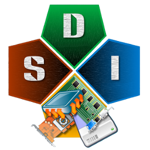

   
  # SDI is a Snappy Driver Installer
  
  
   

A portable Windows tool to install and update device drivers. 

It can be used offline to install drivers where Internet isn't available. 

The perfect technicians tool.

   
---
## Features

Check out [Documentation](https://github.com/gtumanyan/SDI/blob/dev/Docs/refmanual.pdf)

## Download

You can download the prebuilt binary from the [Telegram topic](https://t.me/Snappy_Driver_Installer)

#### Self-built

Follow [guide](https://github.com/gtumanyan/SDI/blob/dev/Docs/building-win-x64.md) if you want to
build by yourself

## Libraries used
- [7-Zip](https://github.com/ozone10/7zip-Dark7zip)
- [Boost](https://github.com/boostorg/boost)
- [Libtorrent](https://github.com/arvidn/libtorrent)
- [Libwebp](https://github.com/webmproject/libwebp)

## Donations

  <a href="bitcoin:bc1q4tkryu9gff0p6wfggrl9f7a0hlkk6rup0jfqle?message=support%20SDI">

