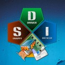

# SDI is a Snappy Driver Installer

## Features

Check out [Documentation](https://github.com/gtumanyan/SDI/blob/dev/Docs/refmanual.pdf)

## Download

You can download the prebuilt binary from the [Telegram topic](https://t.me/Snappy_Driver_Installer)

#### Self-built

Follow [guide](https://github.com/gtumanyan/SDI/blob/dev/Docs/building-win-x64.md) if you want to
build by yourself

## Libraries used

- [7-Zip](https://sourceforge.net/projects/sevenzip)
- [Libtorrent](https://github.com/arvidn/libtorrent)
- [Libwebp](https://github.com/webmproject/libwebp)

## Donations

  <a href="bitcoin:bc1q4tkryu9gff0p6wfggrl9f7a0hlkk6rup0jfqle?message=support%20SDI">
